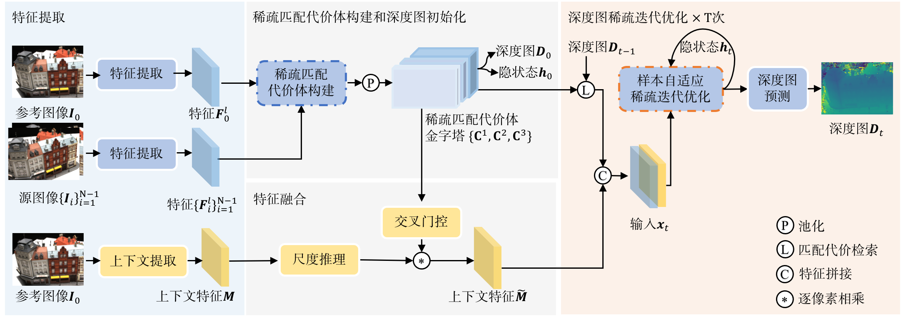
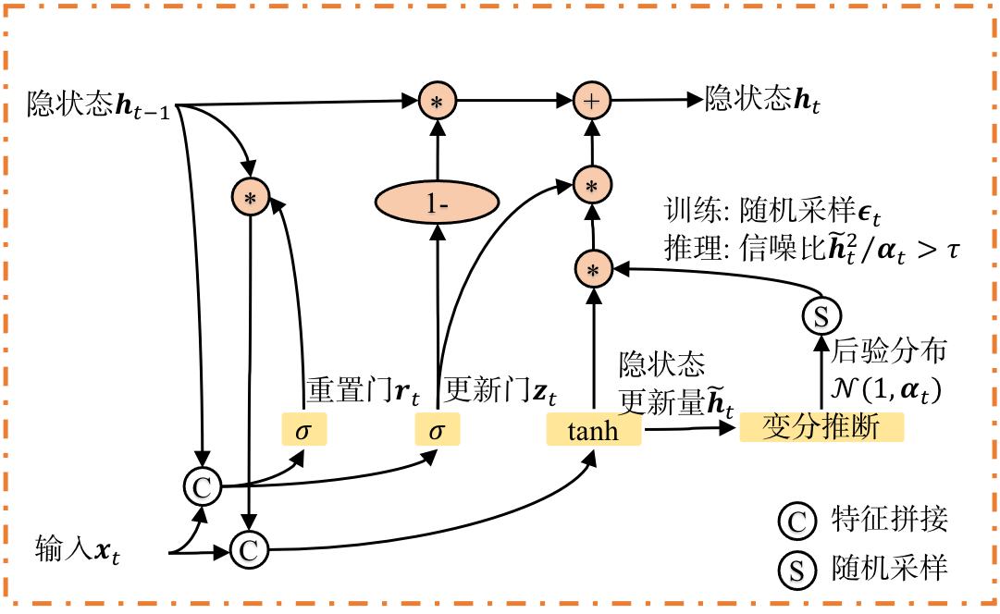
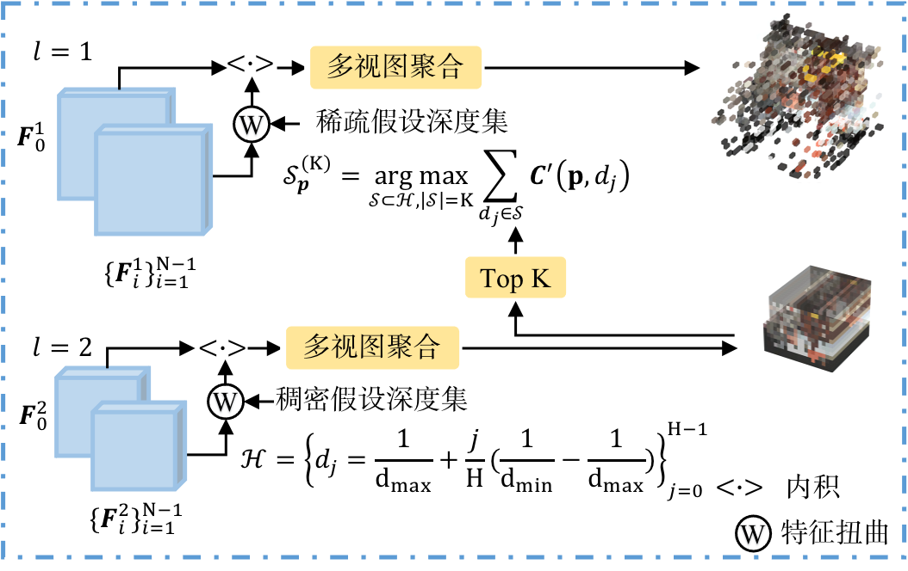
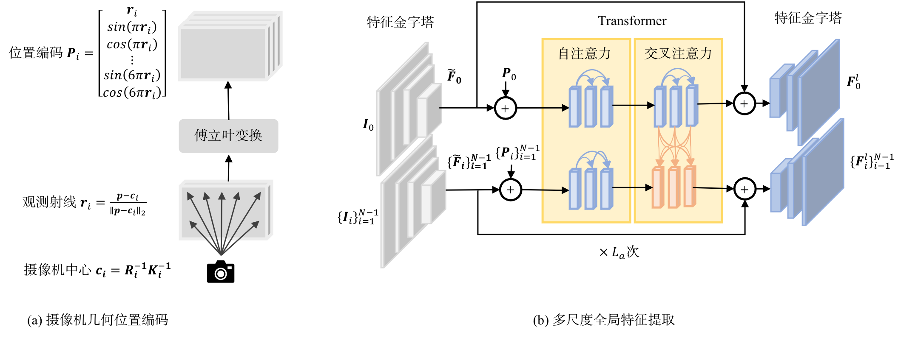
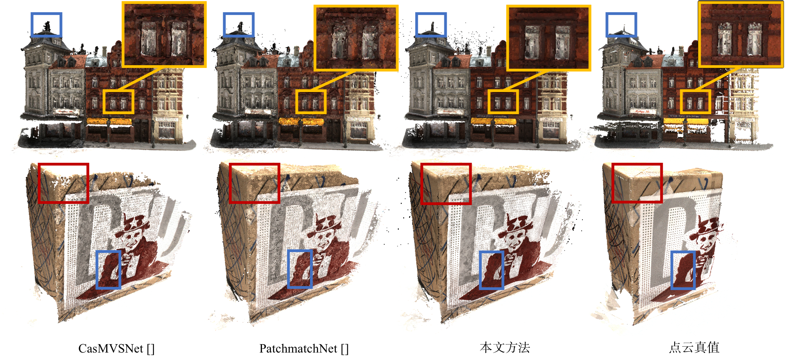

# Adaptive Spatial Sparsification for Efficient Multi-View Stereo Matching (基于自适应空间稀疏化的高效多视图立体匹配)

### [Paper(in Chinese)](https://www.ejournal.org.cn/CN/10.12263/DZXB.20230353)

> Adaptive Spatial Sparsification for Efficient Multi-View Stereo Matching[J] <br />
> [Xiaoqing Zhou](https://github.com/colorfulgreen), [Xiang Wang](mailto:vixwang@buaa.edu.cn), [Jin Zheng](https://scse.buaa.edu.cn/info/1079/8962.htm), [Xiao Bai](https://scse.buaa.edu.cn/info/1078/2669.htm) <br />
> ACTA ELECTONICA SINICA, 2023, 51(11): 3079-3091 https://doi.org/10.12263/DZXB.20230353 


## Overview

This paper presents a novel sparse multi-view stereo matching network, focusing on enhancing both efficiency and reconstruction quality through adaptive sparse computations in depth and image spaces. First, we utilizes the Transformer to extract position-sensitive and view-consistent image features. Then, we introduce a sparse cost volume construction method, wherein we select the top K depth values with the highest matching similarity across the entire depth range as sparse hypothesis. Meanwhile, we propose a sample-adaptive sparse iterative optimization method which iteratively prunes regions with converged depth values. The optimizer incorporates sample-adaptive variational Dropout on the updates of the GRU hidden states, allowing the inference time to adapt to varying images, resulting in a sub-linear growth in inference time. Experimental results on the public datasets, DTU and Tanks & Temples, demonstrate that the proposed method achieves 1.2× and 0.35× improvements of inference speed compared to CasMVSNet and PatchmatchNet, respectively. Moreover, it exhibits excellent performance in point cloud reconstruction, effectively handles details in depth-discontinuous regions, and demonstrates outstanding generalization capability.

<p align="center"></p>


## Sample-Adaptive Sparse Iterative Optimization

We introduce Sparse Variational Dropout to GRU hidden state updates as a sample-adaptive iterative pruning method. During training, we assume the GRU hidden state updates follow logarithmic uniform prior and a fully factorized Gaussian approximate posterior, where the posterior variance is learned using a lightweight convolutional network. During the inference phase, since the updates follow a logarithmic uniform prior, the signal-to-noise ratio of most elements tends towards zero, and the computations on these elements are not needed. By applying Dropout only to candidate updates, the GRU retains its long-term memory capability. Each iteration step is represented as follows:

$$ z_t = \sigma (\text{conv}([h_{t-1}, x_t], W_z)) $$

$$ r_t = \sigma (\text{conv}([h_{t-1}, x_t], W_r)) $$

$$ \gamma_t = g_\Phi(\hat h_t), \quad \alpha_t = \gamma_t^2 / {\hat h_t^2} $$

$$ h_t = (1-z_t) \odot h_{t-1} + z_t \odot \hat h_t \odot \epsilon_t, \quad \epsilon_t \sim N(1, \alpha_t) $$ 

<p align="center"></p>


## Sparse Multi-View Cost Volume

Unlike previous approaches that narrow down the depth sampling range during the refinement stage, we selects the top K depth values with the highest matching similarity across the entire depth range. This enables the network to maintain its modeling capability in depth-discontinuous regions during feature sampling, thus aiding in reducing artifacts such as edge ghosting.

<p align="center"></p>


## Position-Sensitive and View-Consistent Feature Extraction

We integrate Transformer with self-attention layers and cross-attention layers in the bottleneck of Feature Pyramid Network (FPN). The ray directions of each view are embedded into high-dimensional Fourier space as positional encodings.

<p align="center"></p>


## Performance

### DTU

We evalute the reconstruction performance on the DTU test dataset. During evaluation, 5 multi-view images are inputted, with an image resolution of 1600×1184, and a depth sampling range of [425mm, 935mm]. The runtime and memory usage are measured on a NVIDIA RTX 3090 GPU.

| Method        | Acc./mm  | Comp./mm  |  Overall/mm  | Time/s  | Memory/GB |
| ------------- |:---------:|:-----:|:-----:|:-----:|:-----:|
| ASMVSNet (n_iters=1) | 0.343 | 0.342 | 0.342 | 0.14 | 4.15 |
| ASMVSNet (n_iters=4) | 0.328 | 0.302 | 0.315 | 0.17 | 4.15 |

<p align="center"></p>

### Tanks & Temples

To evaluate the generalization capability of ASMVSNet, we submitted the reconstructed point clouds to Tanks & Temples Benchmark (Result: [Intermediate Details](https://www.tanksandtemples.org/details/4844/) | [Advanced Details](https://www.tanksandtemples.org/details/5346/)). We utilized a set of 9 multi-view images, optimizing over 6 iterations.

<p align="center"></p>


## How to Use

```shell
cd scripts/
bash infer_dtu_3d.sh
```


## Citation

If you find this code useful for your research, please use the following Bibtex entry.

```bibtex
@article{zhou2023asmvsnet,
  title={Adaptive Spatial Sparsification for Efficient Multi-View Stereo Matching},
  author={Zhou, Xiaoqing and Wang, Xiang and Zheng, Jin and Bai, Xiao},
  journal={ACTA ELECTONICA SINICA},
  volume={51},
  number={11},
  pages={3079--3091},
  year={2023},
  doi={10.12263/DZXB.20230353},
}
```

```bibtex
@article{zhou2023asmvsnet,
  title={基于自适应空间稀疏化的高效多视图立体匹配},
  author={周晓清 and 王翔 and 郑锦 and 百晓},
  journal={电子学报},
  volume={51},
  number={11},
  pages={3079--3091},
  year={2023},
  doi={10.12263/DZXB.20230353},
}
```


## Acknowledgments

Our work is inspired by [SparseVD](https://github.com/bayesgroup/variational-dropout-sparsifies-dnn), [drop-rnn](https://github.com/ssemeniuta/drop-rnn), [SCV](https://github.com/zacjiang/SCV), and developed based on [MVSNet](https://github.com/YoYo000/MVSNet). We refer to [sige](https://github.com/lmxyy/sige) for the sparse convolution implementation.
